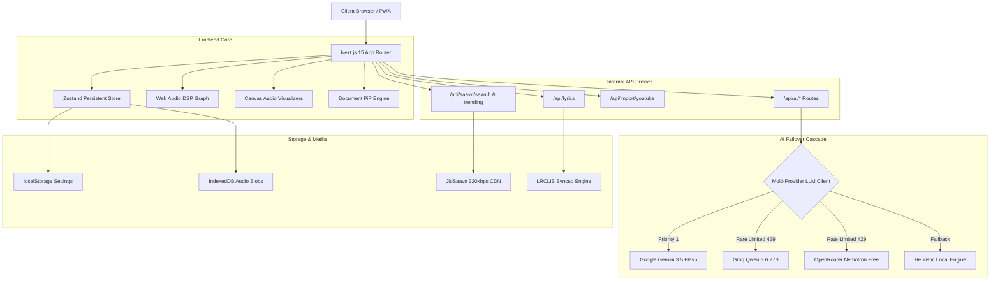

<div align="center">

# 🪶 MAINA
### *Ultra-Luxury Ambient Music Streaming & AI-Powered Discovery Platform*

[-000000?style=for-the-badge&logo=next.js&logoColor=white)](https://nextjs.org/)
[](https://react.dev/)
[](https://www.typescriptlang.org/)
[](https://tailwindcss.com/)
[](https://developer.mozilla.org/en-US/docs/Web/API/Web_Audio_API)
[](https://web.dev/progressive-web-apps/)

<p align="center">
  <b>Maina</b> is a digital sanctuary for audio purists. Designed with an editorial minimalist aesthetic, it blends studio-grade 320kbps streams, dynamic Web Audio DSP processing, synchronous lyrics with real-time phonetic transliteration, and a multi-provider AI curation engine into an ad-free web experience.
</p>

---

[Key Features](#-key-features) •
[Architecture](#-architecture) •
[Quickstart](#-quickstart) •
[AI Intelligence](#-ai-intelligence--failover-cascade) •
[Web Audio DSP](#-web-audio-dsp-suite) •
[Keyboard Shortcuts](#-keyboard-shortcuts) •
[License](#-license)

---

</div>

## 🌟 Key Features

### 🎬 AI-Powered "Flow" Vertical Music Reels (`/flow`)
- **Aesthetic Vertical Snapping**: Fullscreen `snap-y` reel feed designed for rapid discovery.
- **Hook & Chorus Offset Preview**: AI analyzes musical structure and queues preview audio straight at the song's climatic hook.
- **Interactive Action Rail**: Bouncy spring Like heart, Add-to-Playlist (`+`), Full Song Playback trigger, Instagram Story Exporter, and Karaoke Mode switch.

### 🎙️ Web Audio DSP Suite & Studio Fidelity
- **Direct 320kbps MP4/AAC Streams**: Real-time CDN stream decryption via DES-ECB.
- **Parametric GainNode Crossfading**: Smooth 1s–12s volume transition ramps between consecutive tracks.
- **Dynamic Loudness Normalization**: `DynamicsCompressorNode` processing to balance perceived loudness across diverse masters.
- **Karaoke Center-Channel Vocal Reducer**: Mid/Side phase cancellation (`ChannelSplitterNode` + inverter) attenuating center-panned vocals while keeping stereo instrumentals intact.
- **Gapless Preloading Buffer**: Preloads upcoming queue items at 80% progress.

### 📜 Synced Lyrics & Phonetic Hinglish Transliteration
- **Real-Time Synchronized LRC**: Millisecond-precision auto-scrolling lyrics with interactive line-click seeking.
- **Phonetic Hinglish Transliteration Engine**: Automatically transliterates Devanagari Hindi lyrics into romanized phonetic English with custom musical terminology dictionaries and nukta/anusvara normalization.

### 🎨 4 High-Resolution Canvas Visualizer Modes
1. **Frequency Bars**: Dynamic multi-band spectrum analyzer with ambient glow.
2. **Liquid Waves**: Smooth horizontal sinusoidal wave displacement mesh.
3. **Particle Constellation**: Audio-reactive floating particle field with dynamic distance-based constellation linking.
4. **Orbital Ring**: Circular audio-reactive frequency pulse ring.

### 🌙 Ambient Desktop Screensaver & Studio Fullscreen Player
- **Ambient Screensaver**: Minimalist fullscreen standby mode with glowing gradient clock, active lyric lines, and responsive audio visualizers.
- **Fullscreen 3-Segment Switcher**: Toggle seamlessly between `[ Lyrics | Queue | Story ]`.
- **Song Lore & Production Trivia**: AI-synthesized musical metadata (BPM, musical key, studio backstory, and vibe summary).

### 📥 Universal Playlist Importer & Social Card Exporter
- **Universal Importer**: Imports public playlists and albums from **Spotify**, **Apple Music**, and **YouTube** (with continuation token pagination supporting 60+ tracks).
- **Instagram Story / Card Exporter**: Generates custom 9:16 frosted-glass cards with album artwork, song titles, audio waveforms, and active lyric quotes (export PNG or copy to clipboard).
- **Sound Capsule Recap**: Personal listening statistics modal summarizing streamed minutes, top artists, and genre distributions.

### 💾 Offline Storage, Picture-in-Picture & PWA
- **IndexedDB 320kbps Caching**: Caches full audio blobs locally for zero-network playback.
- **Adaptive Document Picture-in-Picture (PiP)**: Floating window that dynamically shifts between *Micro* (<320px), *Standard* (320-480px), and *Studio* (>=480px) modes with interactive seek and volume controls.
- **Progressive Web App (PWA)**: Standalone installable app on macOS, Windows, iOS, and Android.

---

## 🏗️ Architecture



---

## ⚡ Quickstart

### 1. Clone Repository
```bash
git clone https://github.com/Somesh-Thakur/Maina-Final-Portfolio.git
cd Maina-Final-Portfolio
```

### 2. Install Dependencies
```bash
npm install
```

### 3. Configure Environment Variables
Create `.env.local` in the project root:
```bash
cp .env.example .env.local
```

Paste your free API keys into `.env.local`:
```env
# Google Gemini API (Recommended - Free Tier)
# Get key: https://aistudio.google.com/app/apikey
GEMINI_API_KEY=your_gemini_key

# Groq Cloud API (Free & Ultra-Fast)
# Get key: https://console.groq.com/keys
GROQ_API_KEY=your_groq_key

# OpenRouter API (100% Free Tier)
# Get key: https://openrouter.ai/keys
OPENROUTER_API_KEY=your_openrouter_key
```

### 4. Run Development Server
```bash
npm run dev
```

Open [http://localhost:3000](http://localhost:3000) in your browser.

### 5. Build for Production
```bash
npm run build
npm run start
```

---

## 🤖 AI Intelligence & Failover Cascade

Maina features an **Automatic Multi-Provider Failover Cascade**. If any provider encounters rate limits (HTTP 429) or temporary outages, requests automatically drop down to the next free provider with zero latency or error modals:

| Priority | Provider | Free Tier Model | Functionality |
| :--- | :--- | :--- | :--- |
| **1** | **Google Gemini** | `gemini-3.5-flash` | Flow Reels Curation, Semantic Search, Lore |
| **2** | **Groq Cloud** | `qwen/qwen3.6-27b` | Ultra-fast inference & Smart DJ Queue Auto-Refill |
| **3** | **OpenRouter** | `nvidia/nemotron-3.5-lightning:free` | 100% Free multi-model fallback |
| **4** | **Heuristic Engine** | Embedded Local Rule Engine | Offline & Network Dropout Resilience |

---

## 🎛️ Web Audio DSP Suite

```
  [ <audio> Element (320kbps MP4) ]
                 │
                 ▼
  [ AudioContext.createMediaElementSource ]
                 │
  ┌──────────────┴──────────────┐
  ▼                             ▼
[ AnalyserNode ]        [ DynamicsCompressorNode ]
(FFT 256 Spectrum)      (Loudness Leveling)
  │                             │
  ▼                             ▼
[ Canvas Visualizer ]   [ Mid/Side Phase Splitter ]
(4 Dynamic Modes)       (Center-Cancel Karaoke Switch)
                                │
                                ▼
                        [ GainNode Crossfader ]
                        (1s-12s Curve Transitions)
                                │
                                ▼
                        [ AudioContext.destination ]
```

---

## ⌨️ Keyboard Shortcuts

| Shortcut | Action |
| :--- | :--- |
| <kbd>Space</kbd> | Play / Pause Stream |
| <kbd>→</kbd> / <kbd>←</kbd> | Seek Forward / Backward (5s) |
| <kbd>↑</kbd> / <kbd>↓</kbd> | Increase / Decrease Volume (5%) |
| <kbd>M</kbd> | Toggle Mute |
| <kbd>F</kbd> | Toggle Fullscreen Player |
| <kbd>L</kbd> | Like / Heart Active Song |
| <kbd>S</kbd> | Toggle Fair Shuffle |
| <kbd>R</kbd> | Cycle Repeat Mode (`Off` → `All` → `One`) |
| <kbd>/</kbd> | Open Instant Search Mode |
| <kbd>?</kbd> | Open Shortcuts Cheat Sheet Modal |
| <kbd>Esc</kbd> | Close Active Modals / Overlays |

---

## 📡 Discord Rich Presence (RPC) Bridge (Optional)

Maina includes a standalone WebSocket bridge that streams your active playback status to Discord Rich Presence.

To launch the RPC bridge:
```bash
npm run rpc
```

---

## 📦 Tech Stack

- **Framework**: [Next.js 15](https://nextjs.org/) (App Router, Server Components & Route Handlers)
- **UI Library**: [React 19](https://react.dev/)
- **State Management**: [Zustand 5](https://zustand-demo.pmnd.rs/) with LocalStorage persistence
- **Styling**: [Tailwind CSS v4](https://tailwindcss.com/)
- **Motion & Gestures**: [Framer Motion 12](https://www.framer.com/motion/)
- **Icons**: [Lucide React](https://lucide.dev/)
- **Colors & Ambience**: [FastAverageColor](https://github.com/fast-average-color/fast-average-color)
- **Cryptography**: [CryptoJS](https://cryptojs.gitbook.io/docs/) (DES-ECB Decryption)
- **Audio Processing**: Web Audio API (`AudioContext`, `AnalyserNode`, `DynamicsCompressorNode`, `ChannelSplitterNode`, `GainNode`)

---

## 📄 License

This project is licensed under the MIT License — feel free to explore, customize, and build upon it.

<div align="center">
  <sub>Crafted with passion for high-fidelity audio engineering and minimalist design.</sub>
</div>
